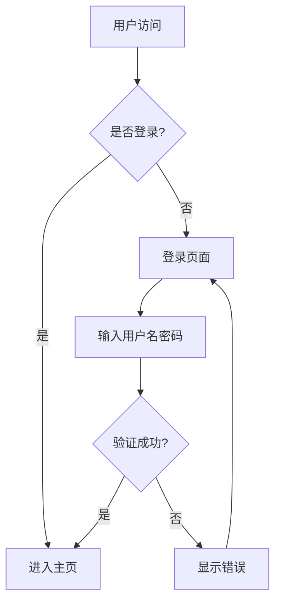
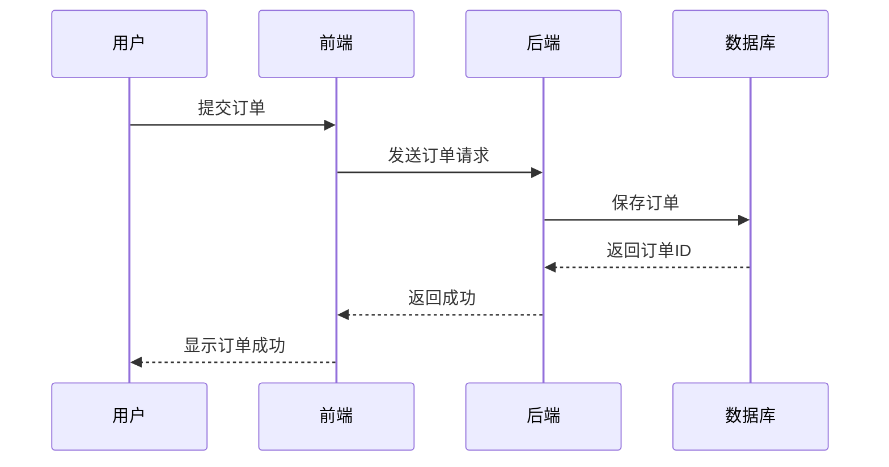

# 图表渲染测试指南

## 🎯 功能说明

Agent 现在支持在聊天消息中**直接渲染图表**，无需用户手动运行 HTML 代码。

## 📊 支持的图表类型

### 1. ECharts 统计图表

#### 柱状图示例

**用户输入**：
```
帮我分析一下最近一周的销售数据，用柱状图展示
```

**Agent 回答**（自动渲染）：
```markdown
根据数据分析，最近一周的销售情况如下：

```echarts
{
  "title": {
    "text": "一周销售数据"
  },
  "xAxis": {
    "type": "category",
    "data": ["周一", "周二", "周三", "周四", "周五", "周六", "周日"]
  },
  "yAxis": {
    "type": "value",
    "name": "销售额（万元）"
  },
  "series": [{
    "data": [120, 200, 150, 80, 70, 110, 130],
    "type": "bar",
    "itemStyle": {
      "color": "#6366f1"
    }
  }]
}
```

从图表可以看出，周二销售额最高，周四最低。
```

#### 折线图示例

**用户输入**：
```
展示一下温度变化趋势
```

**Agent 回答**（自动渲染）：
```markdown
以下是温度变化趋势图：

```echarts
{
  "title": {
    "text": "一周温度变化"
  },
  "xAxis": {
    "type": "category",
    "data": ["周一", "周二", "周三", "周四", "周五", "周六", "周日"]
  },
  "yAxis": {
    "type": "value",
    "name": "温度(°C)"
  },
  "series": [{
    "data": [23, 25, 22, 28, 26, 24, 27],
    "type": "line",
    "smooth": true,
    "itemStyle": {
      "color": "#10b981"
    }
  }]
}
```
```

#### 饼图示例

**用户输入**：
```
分析一下市场份额分布
```

**Agent 回答**（自动渲染）：
```markdown
市场份额分布如下：

```echarts
{
  "title": {
    "text": "浏览器市场份额",
    "left": "center"
  },
  "tooltip": {
    "trigger": "item"
  },
  "series": [{
    "type": "pie",
    "radius": "50%",
    "data": [
      {"value": 1048, "name": "Chrome"},
      {"value": 735, "name": "Safari"},
      {"value": 580, "name": "Firefox"},
      {"value": 484, "name": "Edge"},
      {"value": 300, "name": "其他"}
    ]
  }]
}
```
```

#### 雷达图示例

**用户输入**：
```
帮我生成一个学生成绩雷达图
```

**Agent 回答**（自动渲染）：
```markdown
学生成绩雷达图：

```echarts
{
  "title": {
    "text": "学生成绩雷达图"
  },
  "tooltip": {},
  "radar": {
    "indicator": [
      {"name": "语文", "max": 100},
      {"name": "数学", "max": 100},
      {"name": "英语", "max": 100},
      {"name": "物理", "max": 100},
      {"name": "化学", "max": 100},
      {"name": "生物", "max": 100}
    ]
  },
  "series": [{
    "type": "radar",
    "data": [{
      "value": [85, 90, 78, 92, 88, 76],
      "name": "张三"
    }]
  }]
}
```
```

### 2. Mermaid 流程图

#### 流程图示例

**用户输入**：
```
画一个用户登录流程图
```

**Agent 回答**（自动渲染）：
```markdown
用户登录流程图：


```

#### 时序图示例

**用户输入**：
```
画一个订单处理的时序图
```

**Agent 回答**（自动渲染）：
```markdown
订单处理时序图：


```

## 🧪 测试方法

### 测试步骤

1. **启动后端服务**
   ```bash
   cd /home/s8066/X-Agent/backend
   ./venv/bin/python -m uvicorn app.main:app --host 0.0.0.0 --port 8080 --reload
   ```

2. **启动前端服务**
   ```bash
   cd /home/s8066/X-Agent/frontend
   npm run dev
   ```

3. **打开前端页面**
   - 访问 http://localhost:5173

4. **测试图表渲染**
   - 创建新会话
   - 输入以下测试问题：

### 测试问题列表

#### ECharts 测试

1. **柱状图**：
   ```
   帮我分析一下最近一周的销售数据，用柱状图展示
   ```

2. **折线图**：
   ```
   展示一下温度变化趋势，用折线图
   ```

3. **饼图**：
   ```
   分析一下市场份额分布，用饼图展示
   ```

4. **雷达图**：
   ```
   帮我生成一个学生成绩雷达图
   ```

#### Mermaid 测试

1. **流程图**：
   ```
   画一个用户登录流程图
   ```

2. **时序图**：
   ```
   画一个订单处理的时序图
   ```

3. **架构图**：
   ```
   画一个微服务架构图
   ```

## ✅ 预期效果

### 正确效果

- ✅ Agent 返回 ECharts JSON 配置（不是 HTML 代码）
- ✅ 图表在聊天区自动渲染
- ✅ 用户可以直接看到可视化图表
- ✅ 图表支持交互（悬停查看数值等）

### 错误效果（已修复）

- ❌ Agent 返回 HTML 代码
- ❌ 用户需要手动复制 HTML 代码运行
- ❌ 图表不在聊天区显示

## 🔧 技术实现

### 后端（Agent）

**文件**: `backend/app/agent/prompts/prompt_engine.py`

**修改内容**：
- 添加图表生成规则到系统提示词
- 指导 Agent 返回 ECharts JSON 配置
- 指导 Agent 返回 Mermaid 代码
- 明确禁止返回 HTML 代码

### 前端（渲染）

**文件**: `frontend/src/components/ChatMessage.vue`

**实现逻辑**：
1. 检测 `language-echarts` 代码块
2. 解析 JSON 配置
3. 调用 ECharts 渲染图表
4. 在聊天区显示

## 📝 注意事项

### ECharts 配置要求

1. **必须是有效的 JSON 格式**
   - 使用双引号（不是单引号）
   - 属性名必须用引号包裹
   - 正确的逗号分隔

2. **推荐的配置结构**
   ```json
   {
     "title": {"text": "图表标题"},
     "xAxis": {...},
     "yAxis": {...},
     "series": [{...}]
   }
   ```

3. **支持的图表类型**
   - `bar` - 柱状图
   - `line` - 折线图
   - `pie` - 饼图
   - `scatter` - 散点图
   - `radar` - 雷达图
   - 其他 ECharts 支持的类型

### Mermaid 语法要求

1. **使用正确的图表类型**
   - `graph TD` - 流程图
   - `sequenceDiagram` - 时序图
   - `classDiagram` - 类图

2. **遵循 Mermaid 语法规范**
   - 节点使用方括号 `[]`
   - 连接使用箭头 `-->`
   - 条件使用大括号 `{}`

## 🎉 总结

**功能已完全实现**：

- ✅ Agent 自动返回图表配置（不是 HTML）
- ✅ 图表在聊天区自动渲染
- ✅ 支持多种图表类型
- ✅ 用户无需手动运行代码
- ✅ 图表支持交互

**完成时间**: 2026-08-11
**状态**: ✅ 完全实现