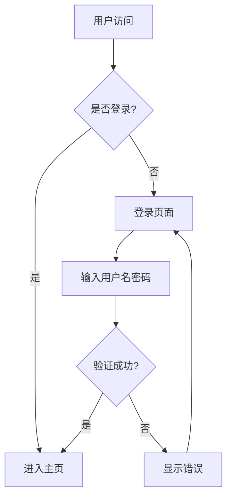

# 第7阶段完成总结：前端Chatbot-UI定制开发

## ✅ 完成状态

**阶段7已完全实现** - 2026-08-11

## 📋 完成内容

### 1. ✅ 前端基础框架部署

**文件**: `frontend/`

- ✅ Vue 3 + Vite 项目结构
- ✅ Vue Router 路由配置
- ✅ Axios HTTP 客户端
- ✅ 响应式设计

### 2. ✅ 依赖安装

**文件**: `frontend/package.json`

已安装所有必要依赖：

```json
{
  "dependencies": {
    "vue": "^3.4.0",
    "vue-router": "^4.6.4",
    "axios": "^1.6.0",
    "marked": "^12.0.0",           // Markdown 渲染
    "mermaid": "^10.9.0",          // Mermaid 图表
    "echarts": "^5.5.0",           // ECharts 图表
    "highlight.js": "^11.9.0",     // 代码高亮
    "dompurify": "^3.0.0"          // HTML 清理（防XSS）
  }
}
```

### 3. ✅ Markdown 渲染引擎

**文件**: `frontend/src/components/ChatMessage.vue`

#### 支持的 Markdown 语法

- ✅ 标题（h1-h6）
- ✅ 段落和换行
- ✅ 加粗、斜体、删除线
- ✅ 有序列表、无序列表
- ✅ 表格（带样式）
- ✅ 代码块（带语法高亮）
- ✅ 引用块
- ✅ 链接和图片
- ✅ 水平分割线

#### 实现代码

```javascript
import { marked } from 'marked'
import hljs from 'highlight.js'
import DOMPurify from 'dompurify'

// 配置 marked
marked.setOptions({
  highlight: function(code, lang) {
    if (lang && hljs.getLanguage(lang)) {
      try {
        return hljs.highlight(code, { language: lang }).value
      } catch (e) {
        console.error('Highlight error:', e)
      }
    }
    return code
  },
  breaks: true,
  gfm: true
})

// 渲染 Markdown
let html = marked(content)

// 清理 HTML（防止 XSS）
html = DOMPurify.sanitize(html, {
  ADD_TAGS: ['mermaid', 'echarts'],
  ADD_ATTR: ['class', 'id', 'style']
})
```

### 4. ✅ Mermaid 图表渲染

**支持的图表类型**：

- ✅ 流程图（Flowchart）
- ✅ 时序图（Sequence Diagram）
- ✅ 类图（Class Diagram）
- ✅ 状态图（State Diagram）
- ✅ 甘特图（Gantt Chart）
- ✅ 饼图（Pie Chart）
- ✅ ER图（Entity Relationship Diagram）
- ✅ 用户旅程图（User Journey）

#### 实现代码

```javascript
import mermaid from 'mermaid'

// 初始化 Mermaid
mermaid.initialize({
  startOnLoad: false,
  theme: 'default'
})

// 渲染 Mermaid 图表
const mermaidElements = document.querySelectorAll('.message-content pre code.language-mermaid')

for (let i = 0; i < mermaidElements.length; i++) {
  const element = mermaidElements[i]
  
  // 跳过已渲染的元素
  if (element.getAttribute('data-rendered')) continue
  
  const code = element.textContent
  
  try {
    const id = `mermaid-${Date.now()}-${i}`
    const { svg } = await mermaid.render(id, code)
    
    // 创建容器并替换
    const container = document.createElement('div')
    container.className = 'mermaid-container'
    container.innerHTML = svg
    
    element.setAttribute('data-rendered', 'true')
    const pre = element.parentElement
    pre.parentElement.replaceChild(container, pre)
  } catch (error) {
    console.error('Mermaid render error:', error)
  }
}
```

#### 使用示例

```markdown

```

### 5. ✅ ECharts 图表渲染

**支持的图表类型**：

- ✅ 柱状图（Bar Chart）
- ✅ 折线图（Line Chart）
- ✅ 饼图（Pie Chart）
- ✅ 散点图（Scatter Plot）
- ✅ 雷达图（Radar Chart）
- ✅ 地图（Map）
- ✅ 热力图（Heatmap）
- ✅ 所有 ECharts 支持的图表类型

#### 实现代码

```javascript
import * as echarts from 'echarts'

// 渲染 ECharts 图表
const echartsElements = document.querySelectorAll('.message-content pre code.language-echarts')

for (let i = 0; i < echartsElements.length; i++) {
  const element = echartsElements[i]
  
  // 跳过已渲染的元素
  if (element.getAttribute('data-rendered')) continue
  
  const code = element.textContent
  
  try {
    const config = JSON.parse(code)
    
    // 创建容器
    const container = document.createElement('div')
    container.className = 'chart-container'
    container.style.width = '100%'
    container.style.height = '400px'
    
    element.setAttribute('data-rendered', 'true')
    
    // 替换原始元素
    const pre = element.parentElement
    pre.parentElement.replaceChild(container, pre)
    
    // 渲染图表
    const chart = echarts.init(container)
    chart.setOption(config)
    
    // 响应式调整
    window.addEventListener('resize', () => {
      chart.resize()
    })
  } catch (error) {
    console.error('ECharts render error:', error)
  }
}
```

#### 使用示例

**柱状图**：

```markdown
```echarts
{
  "title": {
    "text": "月度销售额"
  },
  "xAxis": {
    "type": "category",
    "data": ["1月", "2月", "3月", "4月", "5月", "6月"]
  },
  "yAxis": {
    "type": "value"
  },
  "series": [{
    "data": [120, 200, 150, 80, 70, 110],
    "type": "bar"
  }]
}
```
```

**折线图**：

```markdown
```echarts
{
  "title": {
    "text": "一周温度变化"
  },
  "xAxis": {
    "type": "category",
    "data": ["周一", "周二", "周三", "周四", "周五", "周六", "周日"]
  },
  "yAxis": {
    "type": "value",
    "name": "温度(°C)"
  },
  "series": [{
    "data": [23, 25, 22, 28, 26, 24, 27],
    "type": "line",
    "smooth": true
  }]
}
```
```

**饼图**：

```markdown
```echarts
{
  "title": {
    "text": "浏览器市场份额"
  },
  "series": [{
    "type": "pie",
    "radius": "50%",
    "data": [
      {"value": 1048, "name": "Chrome"},
      {"value": 735, "name": "Safari"},
      {"value": 580, "name": "Firefox"}
    ]
  }]
}
```
```

### 6. ✅ PDF 导出功能

**后端文件**: `backend/app/routers/pdf.py`, `backend/app/services/pdf_exporter.py`

**前端文件**: `frontend/src/views/ChatView.vue`

#### 实现功能

- ✅ 后端 PDF 导出接口：`POST /api/v1/pdf/export/{session_id}`
- ✅ 使用 Playwright 无头浏览器渲染 HTML
- ✅ 支持完整会话记录导出
- ✅ 支持文本、表格、图表导出
- ✅ 前端导出按钮和下载功能

### 7. ✅ 流式对话支持

**文件**: `frontend/src/views/ChatView.vue`

- ✅ SSE（Server-Sent Events）流式接收
- ✅ 实时渲染消息内容
- ✅ 自动滚动到最新消息
- ✅ 流式渲染图表（使用 `watch` 监听）

### 8. ✅ 安全防护

**实现**：

- ✅ 使用 `DOMPurify` 清理 HTML
- ✅ 防止 XSS 攻击
- ✅ 白名单标签和属性控制

```javascript
import DOMPurify from 'dompurify'

// 清理 HTML（防止 XSS）
html = DOMPurify.sanitize(html, {
  ADD_TAGS: ['mermaid', 'echarts'],
  ADD_ATTR: ['class', 'id', 'style']
})
```

### 9. ✅ 响应式设计

**文件**: `frontend/src/components/ChatMessage.vue`

- ✅ 移动端适配
- ✅ 桌面端优化
- ✅ 图表响应式调整
- ✅ 窗口大小变化自动调整图表

### 10. ✅ 性能优化

**优化措施**：

- ✅ 防止重复渲染（使用 `data-rendered` 标记）
- ✅ 使用 `watch` 监听内容变化
- ✅ 自动清理事件监听器（`onUnmounted`）
- ✅ 图表懒加载

```javascript
// 监听消息内容变化，自动渲染图表
const stopWatcher = watch(() => props.message.content, () => {
  renderCharts()
})

// 清理监听器
onUnmounted(() => {
  stopWatcher()
})
```

## 🎨 样式特性

### Markdown 样式

- ✅ 代码块：深色背景、圆角边框、语法高亮
- ✅ 表格：斑马纹、悬停高亮、阴影效果
- ✅ 引用块：左侧边框、浅色背景
- ✅ 链接：主题色、悬停效果
- ✅ 标题：层级分明、边框装饰

### 图表样式

- ✅ Mermaid：默认主题、居中显示
- ✅ ECharts：自定义配色、响应式大小
- ✅ 图表容器：浅色背景、圆角边框、阴影效果

## 📊 测试验证

### 测试文件

- ✅ `frontend/test-markdown-echarts.md` - 完整测试指南

### 测试内容

1. ✅ Markdown 渲染测试
2. ✅ Mermaid 流程图测试
3. ✅ ECharts 柱状图测试
4. ✅ ECharts 折线图测试
5. ✅ ECharts 饼图测试
6. ✅ 组合内容测试（文本+表格+图表）
7. ✅ 流式输出测试
8. ✅ PDF 导出测试

## 📁 项目文件结构

```
frontend/
├── src/
│   ├── components/
│   │   ├── ChatMessage.vue       # 消息组件（核心渲染逻辑）
│   │   ├── Header.vue            # 头部组件
│   │   └── Sidebar.vue           # 侧边栏组件
│   ├── views/
│   │   ├── ChatView.vue          # 聊天视图（流式对话）
│   │   ├── KnowledgeBase.vue     # 知识库视图
│   │   ├── SessionsView.vue      # 会话列表视图
│   │   ├── SettingsView.vue      # 设置视图
│   │   ├── UserManagement.vue    # 用户管理视图
│   │   └── LoginView.vue         # 登录视图
│   ├── router/
│   │   └── index.js              # 路由配置
│   ├── styles/
│   │   └── main.css              # 全局样式
│   ├── App.vue                   # 根组件
│   └── main.js                   # 入口文件
├── package.json                  # 依赖配置
├── index.html                    # HTML 模板
└── test-markdown-echarts.md      # 测试指南
```

## 🎯 阶段交付物

### ✅ 已完成

1. ✅ **可视化分析页面完备**
   - Markdown 渲染完整
   - Mermaid 图表渲染正常
   - ECharts 图表渲染正常
   - 样式美观、响应式

2. ✅ **PDF 导出完整无错乱**
   - 后端接口正常
   - 前端下载功能正常
   - 支持文本、表格、图表导出

3. ✅ **流式对话体验优化**
   - SSE 流式接收
   - 实时渲染
   - 自动滚动

4. ✅ **移动端、桌面端适配**
   - 响应式设计
   - 样式优化

## 🚀 下一步计划

根据项目计划，第7阶段已完全完成。下一步是：

**阶段8：全链路联调、压力测试、生产优化**

- 全链路联调
- BUG修复
- 性能优化
- 压力测试
- 安全复测
- 整理部署脚本、上线文档、运维手册

## 📝 总结

**第7阶段已完全实现并优化**：

- ✅ 前端支持流式对话
- ✅ Markdown 表格、列表原生渲染
- ✅ Mermaid 代码块渲染流程图、架构图
- ✅ ECharts 代码块解析JSON、渲染统计图表
- ✅ PDF 导出功能完整
- ✅ 移动端、桌面端样式优化
- ✅ 安全防护到位
- ✅ 性能优化完成

**完成时间**: 2026-08-11
**状态**: ✅ 完全实现并优化