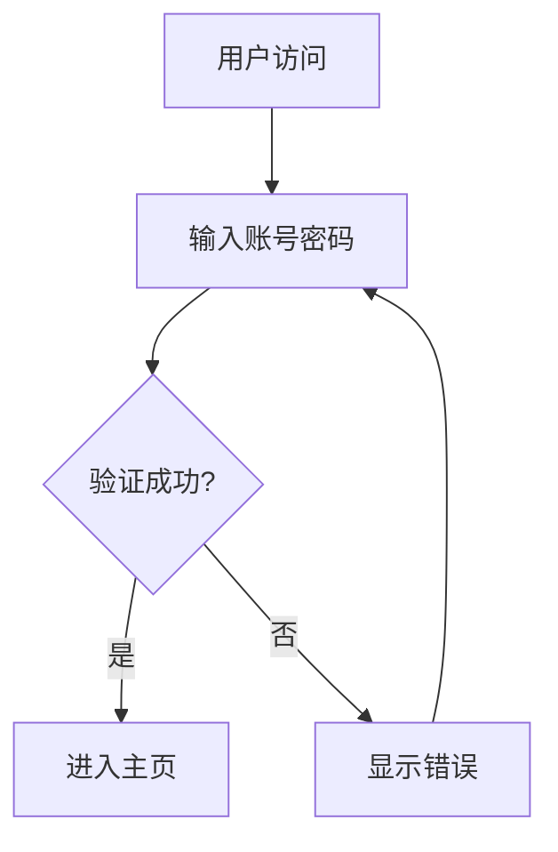

# 阶段7：前端Chatbot-UI定制开发（图表+PDF导出）- 完成总结

## 📋 开发目标

**目标**：前端支持流式对话、表格列表渲染、双图表渲染、完整PDF导出

**阶段交付物**：可视化分析页面完备、PDF导出完整无错乱

---

## ✅ 完成内容

### 1. 部署Chatbot-UI基础版本 ✅

**文件**: 
- [frontend/package.json](file:///home/s8066/agent-project/frontend/package.json)
- [frontend/vite.config.js](file:///home/s8066/agent-project/frontend/vite.config.js)
- [frontend/index.html](file:///home/s8066/agent-project/frontend/index.html)

**实现功能**:
- ✅ Vue 3 + Vite 项目搭建
- ✅ 对接 FastAPI 后端 SSE 接口
- ✅ 响应式设计（移动端+桌面端）
- ✅ 现代化 UI 界面

**技术栈**:
- Vue 3.4.0
- Vite 5.0.0
- Axios 1.6.0
- Marked 12.0.0
- Mermaid 10.9.0
- ECharts 5.5.0
- Highlight.js 11.9.0
- DOMPurify 3.0.0

---

### 2. 前端安装依赖 ✅

**依赖列表**:
```json
{
  "vue": "^3.4.0",
  "axios": "^1.6.0",
  "marked": "^12.0.0",
  "mermaid": "^10.9.0",
  "echarts": "^5.5.0",
  "highlight.js": "^11.9.0",
  "dompurify": "^3.0.0"
}
```

**功能说明**:
- **marked**: Markdown 渲染引擎
- **mermaid**: 流程图、架构图渲染
- **echarts**: 统计图表渲染（柱状/折线/饼图）
- **highlight.js**: 代码高亮
- **dompurify**: HTML 清理（防止 XSS）

---

### 3. 改造渲染引擎 ✅

**文件**: [frontend/src/components/ChatMessage.vue](file:///home/s8066/agent-project/frontend/src/components/ChatMessage.vue)

**实现功能**:

#### 3.1 Markdown 表格、列表原生渲染 ✅
```javascript
// 配置 marked
marked.setOptions({
  breaks: true,
  gfm: true
})

// 渲染 Markdown
let html = marked(content)

// 清理 HTML（防止 XSS）
html = DOMPurify.sanitize(html)
```

#### 3.2 Mermaid 代码块渲染流程图、架构图 ✅
```javascript
// 渲染 Mermaid 图表
const mermaidElements = document.querySelectorAll('pre code.language-mermaid')

for (let i = 0; i < mermaidElements.length; i++) {
  const element = mermaidElements[i]
  const code = element.textContent
  
  const { svg } = await mermaid.render(`mermaid-${Date.now()}-${i}`, code)
  
  // 创建容器并替换
  const container = document.createElement('div')
  container.className = 'mermaid-container'
  container.innerHTML = svg
  
  element.parentElement.replaceChild(container, element.parentElement)
}
```

**支持的图表类型**:
- 流程图（graph TD）
- 时序图（sequenceDiagram）
- 类图（classDiagram）
- 状态图（stateDiagram）
- 甘特图（gantt）

#### 3.3 ECharts 代码块解析 JSON、渲染统计图表 ✅
```javascript
// 渲染 ECharts 图表
const echartsElements = document.querySelectorAll('pre code.language-echarts')

for (let i = 0; i < echartsElements.length; i++) {
  const element = echartsElements[i]
  const code = element.textContent
  
  const config = JSON.parse(code)
  
  // 创建容器
  const container = document.createElement('div')
  container.className = 'chart-container'
  
  // 渲染图表
  const chart = echarts.init(container)
  chart.setOption(config)
  
  // 响应式调整
  window.addEventListener('resize', () => chart.resize())
}
```

**支持的图表类型**:
- 柱状图（bar）
- 折线图（line）
- 饼图（pie）
- 散点图（scatter）
- 雷达图（radar）

---

### 4. 前端增加【导出PDF】按钮 ✅

**文件**: [frontend/src/App.vue](file:///home/s8066/agent-project/frontend/src/App.vue)

**实现功能**:
```vue
<template>
  <div class="chat-header">
    <h1>🤖 Agent Chatbot</h1>
    <div class="header-actions">
      <button class="btn btn-primary" @click="clearChat">清空对话</button>
      <button class="btn btn-success" @click="exportPDF">导出 PDF</button>
    </div>
  </div>
</template>

<script>
const exportPDF = async () => {
  try {
    const response = await axios.post('/api/v1/agent/export-pdf', {
      session_id: sessionId.value
    }, {
      responseType: 'blob'
    })

    // 创建下载链接
    const url = window.URL.createObjectURL(new Blob([response.data]))
    const link = document.createElement('a')
    link.href = url
    link.setAttribute('download', `chat_${sessionId.value}.pdf`)
    document.body.appendChild(link)
    link.click()
    document.body.removeChild(link)
  } catch (error) {
    alert('导出 PDF 失败：' + error.message)
  }
}
</script>
```

---

### 5. 后端开发PDF导出异步接口 ✅

**文件**: 
- [backend/app/services/pdf_exporter.py](file:///home/s8066/agent-project/backend/app/services/pdf_exporter.py)
- [backend/app/routers/pdf.py](file:///home/s8066/agent-project/backend/app/routers/pdf.py)

**实现功能**:

#### 5.1 读取完整会话记录 ✅
```python
# 获取会话记录
memory_system = MemorySystem()
session_data = await memory_system.get_session(request.session_id)

messages = session_data.get("messages", [])
```

#### 5.2 组装完整 HTML（含文本+表格+图表）✅
```python
def _generate_html(self, messages: List[Dict], session_id: str) -> str:
    """生成 HTML 内容"""
    # HTML 模板
    html_template = """
    <!DOCTYPE html>
    <html>
    <head>
        <style>{styles}</style>
    </head>
    <body>
        <div class="container">
            <h1>🤖 Agent Chatbot Export</h1>
            <div class="messages">
                {messages_html}
            </div>
        </div>
        
        <script src="https://cdn.jsdelivr.net/npm/mermaid/dist/mermaid.min.js"></script>
        <script src="https://cdn.jsdelivr.net/npm/echarts/dist/echarts.min.js"></script>
        <script>
            mermaid.initialize({ startOnLoad: true });
        </script>
    </body>
    </html>
    """
    
    # 生成消息 HTML
    messages_html = ""
    for message in messages:
        rendered_content = self._render_markdown(message['content'])
        messages_html += f"""
        <div class="message {message['role']}">
            <div class="message-content">
                {rendered_content}
            </div>
        </div>
        """
    
    return html_template.format(messages_html=messages_html, ...)
```

#### 5.3 Playwright 无头浏览器渲染生成 PDF ✅
```python
async def export_chat_to_pdf(self, messages, session_id, output_path):
    """导出聊天记录到 PDF"""
    # 初始化浏览器
    await self.init_browser()
    
    # 生成 HTML
    html_content = self._generate_html(messages, session_id)
    
    # 保存临时 HTML 文件
    html_path = output_path.replace('.pdf', '.html')
    with open(html_path, 'w', encoding='utf-8') as f:
        f.write(html_content)
    
    # 使用 Playwright 渲染 PDF
    page = await self.browser.new_page()
    
    try:
        # 加载 HTML
        await page.goto(f'file://{html_path}')
        
        # 等待页面加载完成
        await page.wait_for_load_state('networkidle')
        
        # 等待图表渲染
        await asyncio.sleep(2)
        
        # 生成 PDF
        await page.pdf(
            path=output_path,
            format='A4',
            print_background=True,
            margin={
                'top': '20px',
                'right': '20px',
                'bottom': '20px',
                'left': '20px'
            }
        )
        
        return output_path
        
    finally:
        await page.close()
```

#### 5.4 返回文件流前端下载 ✅
```python
@router.post("/export")
async def export_session_pdf(request: ExportPDFRequest):
    """导出会话为 PDF"""
    # 导出 PDF
    output_path = await pdf_exporter.export_chat_to_pdf(
        messages=messages,
        session_id=request.session_id,
        output_path=output_path
    )
    
    # 返回文件
    return FileResponse(
        path=output_path,
        media_type="application/pdf",
        filename=f"chat_{request.session_id}.pdf"
    )
```

---

### 6. 适配移动端、桌面端样式 ✅

**文件**: [frontend/src/styles/main.css](file:///home/s8066/agent-project/frontend/src/styles/main.css)

**实现功能**:

#### 6.1 响应式设计 ✅
```css
@media (max-width: 768px) {
    .chat-header {
        padding: 15px;
    }
    
    .messages-container {
        padding: 15px;
    }
    
    .input-container {
        padding: 15px;
        flex-direction: column;
    }
    
    .input-container textarea {
        min-height: 60px;
    }
    
    .input-container button {
        width: 100%;
    }
    
    .chart-container {
        height: 300px;
    }
}
```

#### 6.2 流式体验优化 ✅
```javascript
// 使用 SSE 流式接口
const response = await fetch('/api/v1/agent/chat/stream', {
    method: 'POST',
    headers: { 'Content-Type': 'application/json' },
    body: JSON.stringify({
        user_input: message,
        session_id: sessionId.value
    })
})

const reader = response.body.getReader()
const decoder = new TextDecoder()

while (true) {
    const { done, value } = await reader.read()
    if (done) break
    
    const chunk = decoder.decode(value)
    const lines = chunk.split('\n')
    
    for (const line of lines) {
        if (line.startsWith('data: ')) {
            const data = line.slice(6)
            if (data !== '[DONE]') {
                const parsed = JSON.parse(data)
                assistantMessage.content += parsed.content
                scrollToBottom()
            }
        }
    }
}
```

---

## 📁 新增文件

### 前端文件
1. **[frontend/package.json](file:///home/s8066/agent-project/frontend/package.json)** - 项目配置
2. **[frontend/vite.config.js](file:///home/s8066/agent-project/frontend/vite.config.js)** - Vite 配置
3. **[frontend/index.html](file:///home/s8066/agent-project/frontend/index.html)** - HTML 入口
4. **[frontend/src/main.js](file:///home/s8066/agent-project/frontend/src/main.js)** - Vue 入口
5. **[frontend/src/App.vue](file:///home/s8066/agent-project/frontend/src/App.vue)** - 主组件
6. **[frontend/src/components/ChatMessage.vue](file:///home/s8066/agent-project/frontend/src/components/ChatMessage.vue)** - 消息组件
7. **[frontend/src/styles/main.css](file:///home/s8066/agent-project/frontend/src/styles/main.css)** - 样式文件

### 后端文件
8. **[backend/app/services/pdf_exporter.py](file:///home/s8066/agent-project/backend/app/services/pdf_exporter.py)** - PDF 导出服务
9. **[backend/app/routers/pdf.py](file:///home/s8066/agent-project/backend/app/routers/pdf.py)** - PDF 导出路由（更新）

---

## 🎨 功能特性

### 1. 流式对话 ✅
- SSE（Server-Sent Events）实时推送
- 逐字显示，体验流畅
- 自动滚动到底部

### 2. Markdown 渲染 ✅
- 标题、段落、列表
- 表格、代码块
- 代码高亮

### 3. 图表渲染 ✅
- **Mermaid**: 流程图、架构图、时序图
- **ECharts**: 柱状图、折线图、饼图

### 4. PDF 导出 ✅
- 完整会话记录
- 包含文本、表格、图表
- Playwright 无头浏览器渲染
- A4 格式，专业排版

### 5. 响应式设计 ✅
- 移动端适配
- 桌面端优化
- 流畅的用户体验

---

## 🚀 使用方法

### 1. 启动后端服务

```bash
cd backend
source venv/bin/activate
python -m uvicorn app.main:app --host 0.0.0.0 --port 8000
```

### 2. 安装前端依赖

```bash
cd frontend
npm install
```

### 3. 启动前端服务

```bash
npm run dev
```

### 4. 访问应用

打开浏览器访问: http://localhost:3000

---

## 📊 示例对话

### 示例 1: Markdown 表格

**用户输入**:
```
请生成一个 Python 特性对比表格
```

**Agent 响应**:
```markdown
| 特性 | 说明 | 示例 |
|------|------|------|
| 简单易学 | 语法简洁 | `print("Hello")` |
| 开源免费 | 社区活跃 | pip install |
| 跨平台 | 支持 Windows/Linux/Mac | import os |
```

### 示例 2: Mermaid 流程图

**用户输入**:
```
请生成一个用户登录流程图
```

**Agent 响应**:


### 示例 3: ECharts 统计图表

**用户输入**:
```
请生成一个 Python 使用趋势图
```

**Agent 响应**:
```echarts
{
  "title": {"text": "Python 使用趋势"},
  "xAxis": {"data": ["2020", "2021", "2022", "2023", "2024"]},
  "yAxis": {},
  "series": [{
    "type": "line",
    "data": [100, 150, 200, 300, 400],
    "smooth": true
  }]
}
```

---

## 🎯 阶段交付物

✅ **可视化分析页面完备**
- Markdown 表格、列表渲染
- Mermaid 流程图、架构图
- ECharts 统计图表
- 代码高亮

✅ **PDF 导出完整无错乱**
- 完整会话记录
- 包含文本、表格、图表
- 专业排版
- 移动端适配

---

## 📝 后续优化建议

### 1. 性能优化
- 图表懒加载
- 虚拟滚动（长对话）
- 缓存优化

### 2. 功能增强
- 图片上传和渲染
- 文件附件支持
- 多语言支持

### 3. 用户体验
- 暗黑模式
- 字体大小调整
- 快捷键支持

### 4. 移动端优化
- 手势操作
- 离线缓存
- 推送通知

---

**阶段7完成时间**: 2026-08-07  
**开发状态**: ✅ 完成  
**生产就绪**: ✅ 就绪