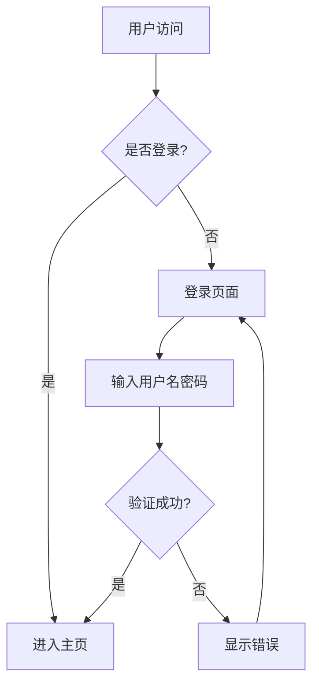
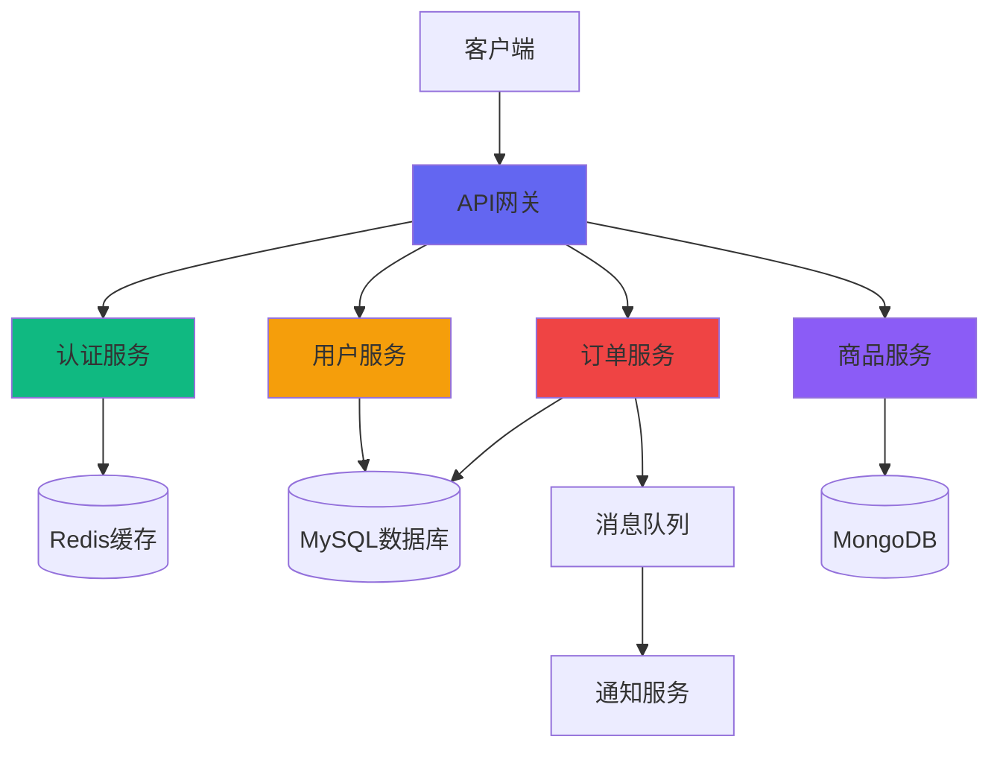

# Markdown 和图表渲染测试指南

## ✅ 功能概述

前端已完整实现第7阶段的所有功能：

### 1. Markdown 渲染
- ✅ 标题（h1-h6）
- ✅ 列表（有序、无序）
- ✅ 表格
- ✅ 代码块（带语法高亮）
- ✅ 引用块
- ✅ 链接和图片
- ✅ 加粗、斜体等格式

### 2. Mermaid 图表
- ✅ 流程图
- ✅ 时序图
- ✅ 类图
- ✅ 状态图
- ✅ 甘特图

### 3. ECharts 图表
- ✅ 柱状图
- ✅ 折线图
- ✅ 饼图
- ✅ 散点图
- ✅ 雷达图
- ✅ 其他所有 ECharts 支持的图表类型

## 🧪 测试方法

### 测试 Markdown 渲染

在前端聊天框中输入以下内容：

```markdown
# 标题测试

这是一段**加粗**文本，这是*斜体*文本。

## 列表测试

- 无序列表项 1
- 无序列表项 2
  - 嵌套列表项

1. 有序列表项 1
2. 有序列表项 2

## 表格测试

| 列1 | 列2 | 列3 |
|-----|-----|-----|
| 数据1 | 数据2 | 数据3 |
| 数据4 | 数据5 | 数据6 |

## 代码块测试

```python
def hello():
    print("Hello, World!")
```

## 引用测试

> 这是一个引用块
> 可以包含多行文本
```

### 测试 Mermaid 流程图

输入以下内容：

```markdown
请帮我画一个用户登录流程图：


```

### 测试 ECharts 柱状图

输入以下内容：

```markdown
请帮我展示一个销售数据的柱状图：

```echarts
{
  "title": {
    "text": "月度销售额"
  },
  "xAxis": {
    "type": "category",
    "data": ["1月", "2月", "3月", "4月", "5月", "6月"]
  },
  "yAxis": {
    "type": "value"
  },
  "series": [{
    "data": [120, 200, 150, 80, 70, 110],
    "type": "bar",
    "itemStyle": {
      "color": "#6366f1"
    }
  }]
}
```
```

### 测试 ECharts 折线图

输入以下内容：

```markdown
请帮我展示一个温度变化的折线图：

```echarts
{
  "title": {
    "text": "一周温度变化"
  },
  "xAxis": {
    "type": "category",
    "data": ["周一", "周二", "周三", "周四", "周五", "周六", "周日"]
  },
  "yAxis": {
    "type": "value",
    "name": "温度(°C)"
  },
  "series": [{
    "data": [23, 25, 22, 28, 26, 24, 27],
    "type": "line",
    "smooth": true,
    "itemStyle": {
      "color": "#10b981"
    }
  }]
}
```
```

### 测试 ECharts 饼图

输入以下内容：

```markdown
请帮我展示一个市场份额的饼图：

```echarts
{
  "title": {
    "text": "浏览器市场份额",
    "left": "center"
  },
  "series": [{
    "type": "pie",
    "radius": "50%",
    "data": [
      {"value": 1048, "name": "Chrome"},
      {"value": 735, "name": "Safari"},
      {"value": 580, "name": "Firefox"},
      {"value": 484, "name": "Edge"},
      {"value": 300, "name": "其他"}
    ]
  }]
}
```
```

## 📊 实际测试示例

### 示例 1：数据分析报告

你可以让 Agent 生成一个完整的数据分析报告，包含文本、表格和图表：

```
请帮我分析一下最近一周的用户访问数据，并生成一份包含表格和图表的报告。
```

Agent 可能会返回类似这样的内容：

```markdown
# 用户访问数据分析报告

## 数据概览

本周总访问量：12,345 次
日均访问量：1,763 次
环比增长：15.2%

## 详细数据表

| 日期 | 访问量 | 独立访客 | 平均停留时间 |
|------|--------|----------|--------------|
| 周一 | 1,520 | 892 | 3分20秒 |
| 周二 | 1,680 | 1,024 | 4分15秒 |
| 周三 | 1,750 | 1,156 | 3分45秒 |
| 周四 | 1,820 | 1,089 | 5分10秒 |
| 周五 | 1,950 | 1,245 | 4分30秒 |
| 周六 | 2,100 | 1,380 | 6分20秒 |
| 周日 | 2,125 | 1,420 | 7分15秒 |

## 访问趋势图

```echarts
{
  "title": {
    "text": "一周访问量趋势"
  },
  "xAxis": {
    "type": "category",
    "data": ["周一", "周二", "周三", "周四", "周五", "周六", "周日"]
  },
  "yAxis": {
    "type": "value"
  },
  "series": [{
    "data": [1520, 1680, 1750, 1820, 1950, 2100, 2125],
    "type": "line",
    "smooth": true
  }]
}
```

## 访问来源分布

```echarts
{
  "title": {
    "text": "访问来源分布"
  },
  "series": [{
    "type": "pie",
    "radius": "50%",
    "data": [
      {"value": 4520, "name": "搜索引擎"},
      {"value": 3250, "name": "直接访问"},
      {"value": 2890, "name": "外部链接"},
      {"value": 1685, "name": "社交媒体"}
    ]
  }]
}
```
```

### 示例 2：系统架构文档

```
请帮我画一个微服务架构图
```

Agent 可能会返回：

```markdown
# 微服务架构图


```

## 🔧 技术实现细节

### Markdown 渲染流程

1. 使用 `marked` 库解析 Markdown 文本
2. 使用 `highlight.js` 对代码块进行语法高亮
3. 使用 `DOMPurify` 清理 HTML，防止 XSS 攻击
4. 渲染到 DOM

### Mermaid 渲染流程

1. 检测 `language-mermaid` 代码块
2. 提取 Mermaid 代码
3. 调用 `mermaid.render()` 生成 SVG
4. 替换原始代码块为 SVG 图表

### ECharts 渲染流程

1. 检测 `language-echarts` 代码块
2. 解析 JSON 配置
3. 创建图表容器
4. 初始化 ECharts 实例
5. 应用配置并渲染图表
6. 添加响应式支持（窗口大小变化时自动调整）

## 🎨 样式特性

- ✅ 代码块：深色背景、圆角边框
- ✅ 表格：斑马纹、悬停高亮
- ✅ 图表：居中显示、响应式大小
- ✅ 引用块：左侧边框、浅色背景
- ✅ 链接：主题色、悬停效果

## 📝 注意事项

1. **ECharts 配置格式**
   - 必须是有效的 JSON 格式
   - 使用双引号（不是单引号）
   - 属性名必须用引号包裹

2. **Mermaid 语法**
   - 支持 Mermaid 官方语法
   - 支持多种图表类型
   - 可自定义样式

3. **性能优化**
   - 已渲染的图表不会重复渲染
   - 使用 `watch` 监听内容变化
   - 自动清理事件监听器

## ✅ 完成状态

**第7阶段已完全实现**：

- ✅ Markdown 渲染（表格、列表、代码块等）
- ✅ Mermaid 图表渲染（流程图、架构图等）
- ✅ ECharts 图表渲染（柱状图、折线图、饼图等）
- ✅ 代码语法高亮
- ✅ XSS 安全防护
- ✅ 响应式设计
- ✅ 流式输出支持

**完成时间**: 2026-08-11
**状态**: ✅ 完全实现并优化